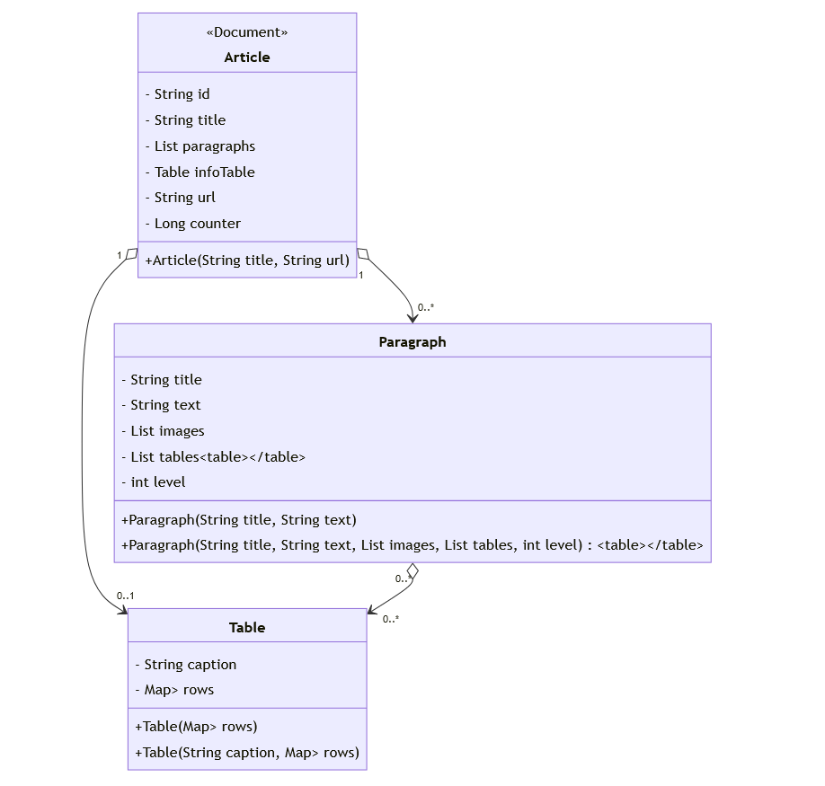

# Openwikipedia
OpenWikipedia is a web application that leverages Mediawiki's API to store an article from Wikipedia, and edit its content. The backend was made with the Spring Framework and Java 21.

## Installation
clone your OpenWikipedia backend repository using the following command:
1. **Clone the repository**:
   ```bash
   git clone git@github.com:francescoflores/OpenWikipediaBE.git
---

2. **Set Up MongoDB:**:
Ensure you have MongoDB installed and running. If not, install the version you prefer from: [MongoDB](https://www.mongodb.com/)

3. **Set Up Java and Maven:**:
Ensure you have Java 21 and maven installed. 
[Maven](https://maven.apache.org/)

## Usage
Navigate to the project directory and run the application with: 

```bash
mvn spring-boot:run
```

## Technologies
The backend is Written in Java 21 with the Spring Framework, and uses the JSoup java library, that can be found in https://jsoup.org/, to fetch an Article from Wikipedia. 

## Structure
The System is made of An Article Entity, and a User Entity. 
The Article class models the primary entity, an article, which is stored as a document in MongoDB. Other than an Id, a Title and a List of strings which represent the URL of an Image, the Article Entity is made of 2 complex Attributes: 
- a list of Paragraphs 
- a List of Tables. 

These classes are saved in the Document Oriented Database as Nested Objects inside the Article Documents, when present.

### Paragraphs
A Paragraph is made of: 
- a title
- a text
- a List of images
- a List of Table
- a Level

The Level is an int attribute that simplifies the indexing of the Paragraphs inside the article's Frontend.

### Table
The Table class is designed to encapsulate structured tabular data commonly found in articles, such as those on Wikipedia. It's composed of:
- a caption for the table
- a mapping of rows, where each row consists of a key and a list of objects, representing the header of a table. 

I chose the Object class as a Table's cell type, to represent different types of data within a cell, including other tables or text strings.


